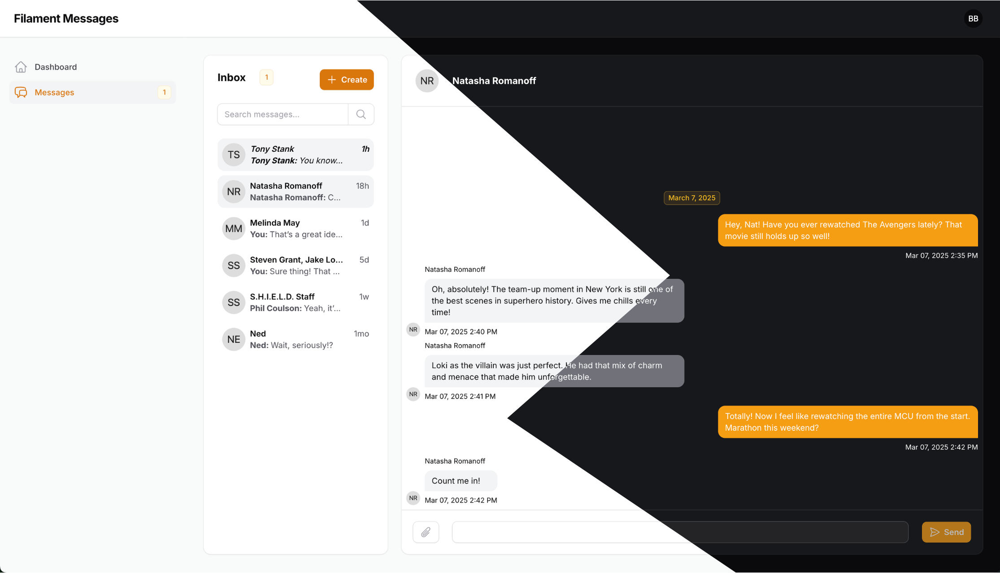
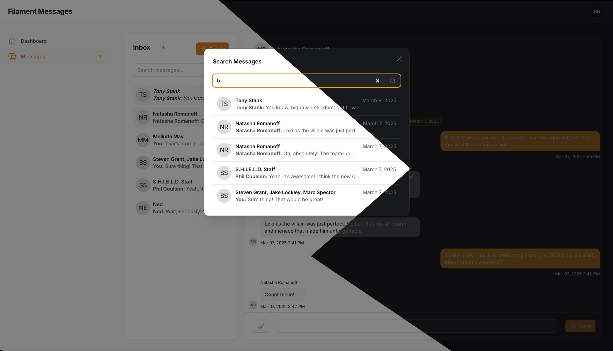
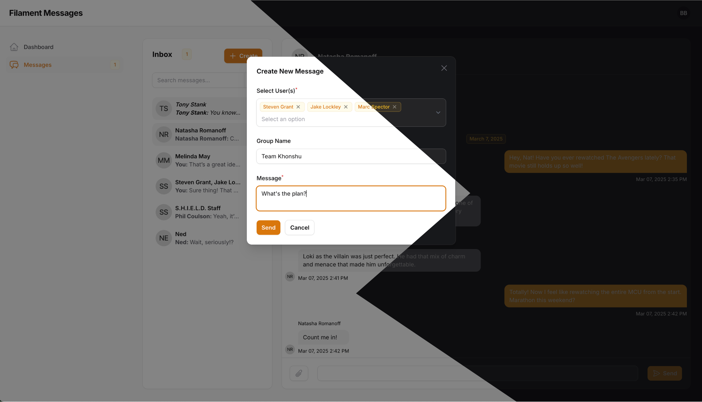

# Filament Messages

**Filament Messages** is a powerful messaging plugin for [FilamentPHP](https://filamentphp.com/). It provides an easy-to-use interface for real-time messaging within Filament admin panels.


<p align="center">
  
  
</p>


**Key Features:**
- **Seamless Integration:** Designed specifically for FilamentPHP, making it easy to integrate into your admin panel.
- **User-to-User & Group Chats:** Enables both private conversations and group discussions.
- **Unread Message Badges:** Displays unread message counts in the sidebar for better visibility.
- **File Attachments:** Allows sending images, documents, and other media.
- **Database-Driven:** Uses Eloquent models for structured and scalable messaging.
- **Configurable Refresh Interval:** Lets you set the chat update frequency for optimized performance.
- **Timezone Support:** Allows setting a preferred timezone to maintain consistent timestamps across messages.

## Table of Contents
[Getting Started](#getting-started)<br/>
[Prerequisite](#prerequisite)<br/>
[User Model](#user-model)<br/>
[Admin Panel Provider](#admin-panel-provider)<br/>
[Plugins Used](#plugins-used)<br/>
[Acknowledgments](#acknowledgments)<br/>
[Support](#support)

<a name="getting-started"></a>
## Getting Started
You can install the package via Composer:

```bash
composer require raseldev99/filament-messages
```

Run this command to install all migrations and configurations.

```bash
php artisan filament-messages:install
```

<a name="prerequisite"></a>
## Prerequisite
This plugin utilizes Filament Spatie Media Library. Please follow the steps below.

Install the plugin with Composer:

```bash
composer require filament/spatie-laravel-media-library-plugin:"^3.2" -W
```

If you haven't already done so, you need to publish the migration to create the media table:

```bash
php artisan vendor:publish --provider="Spatie\MediaLibrary\MediaLibraryServiceProvider" --tag="medialibrary-migrations"
```

Run the migrations:

```bash
php artisan migrate
```

Or follow the documentation [here](https://github.com/filamentphp/spatie-laravel-media-library-plugin).

<a name="user-model"></a>
## User Model
Add the trait to your User model:

```bash
<?php

use Raseldev99\FilamentMessages\Models\Traits\HasFilamentMessages;

class User extends Authenticatable
{
    use HasFilamentMessages;
}

?>
```

<a name="admin-panel-provider"></a>
## Admin Panel Provider
Add this plugin to your FilamentPHP panel provider:

```bash
<?php

use Raseldev99\FilamentMessages\FilamentMessagesPlugin;

class AdminPanelProvider extends PanelProvider
{
    public function panel(Panel $panel): Panel
    {
        return $panel
            ->plugins([
                FilamentMessagesPlugin::make()
            ]);
    }
}
?>
```

<a name="plugins-used"></a>
## Plugins Used
These are [Filament Plugins](https://filamentphp.com/plugins) use for this project.

| **Plugin**                                                                                          | **Author**                                              |
| :-------------------------------------------------------------------------------------------------- | :------------------------------------------------------ |
| [Filament Spatie Media Library](https://github.com/filamentphp/spatie-laravel-media-library-plugin) | [Filament Official](https://github.com/filamentphp)     |

<a name="acknowledgments"></a>
## Acknowledgments
- [FilamentPHP](https://filamentphp.com)
- [Laravel](https://laravel.com)
- [FilaChat](https://github.com/199ocero/filachat)

<a name="support"></a>
## Support
- [Report a bug](https://github.com/jeddsaliba/filament-messages/issues)
- [Request a feature](https://github.com/jeddsaliba/filament-messages/issues)
- [Email support](mailto:jeddsaliba@gmail.com)

## Show Your Support

Give a ⭐️ if this project helped you!
